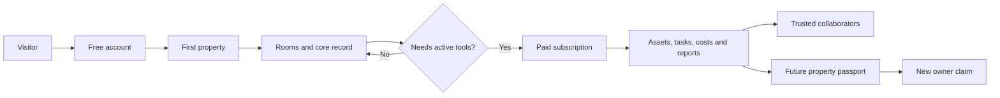

# User flows

> Status: Draft for client approval  
> Version: 0.1  
> Prepared: 15 July 2026  
> Product name: Home Vault (working title)

## Overall path

## FLOW-01 - Discover, register and start

**Phase:** MVP  
**Trigger:** A visitor wants a better way to retain home or property information.

### Steps

1. View the public proposition and compare the free and paid value.
2. Create an account or sign in.
3. Complete a basic profile.
4. Start the guided add-property flow.

**Outcome:** The customer reaches a usable first-property record with minimal friction.  
**Features:** F-01, F-02, F-03

## FLOW-02 - Add a property and its rooms

**Phase:** MVP  
**Trigger:** A registered owner wants to establish a property record.

### Steps

1. Enter or look up the property address.
2. Confirm available property details or enter them manually.
3. Classify the property, including whether it is the owner's home or a rental/investment property.
4. Accept suggested standard rooms and add, rename or remove rooms.

**Outcome:** A structured property-and-room record is ready for content.  
**Features:** F-03, F-04

## FLOW-03 - Build the visual room record

**Phase:** MVP  
**Trigger:** An owner wants to remember what is in a room and how it has changed.

### Steps

1. Open a room within a property.
2. Upload current or before-and-after photos.
3. Record paint colours, finishes and room notes.
4. Add related assets, documents, costs or tasks where the owner's plan permits.

**Outcome:** The room becomes a useful, visual source of truth.  
**Features:** F-04, F-05, F-06, F-07

## FLOW-04 - Record an asset, invoice and warranty

**Phase:** MVP  
**Trigger:** An appliance, fixture or other depreciable/maintainable item is purchased or identified.

### Steps

1. Select the property and, where relevant, the room.
2. Create the asset with purchase, supplier/trade and product details.
3. Upload the invoice, receipt and warranty documents.
4. Record warranty expiry and service information.

**Outcome:** The asset and its supporting evidence can be found, maintained and reported.  
**Features:** F-05, F-06, F-08

## FLOW-05 - Plan and complete property work

**Phase:** MVP  
**Trigger:** Maintenance or renovation work needs to be planned or repeated.

### Steps

1. Create a task against a property, room or asset.
2. Set a due date and optional recurrence.
3. Review tasks in calendar or Kanban-style views.
4. Receive an email reminder and complete or reschedule the task.

**Outcome:** Important work is visible and less likely to be missed.  
**Features:** F-06

## FLOW-06 - Track costs, expenses and renovation budget

**Phase:** MVP  
**Trigger:** The owner receives a bill, incurs a renovation cost or wants to understand household operating costs.

### Steps

1. Choose asset, renovation cost or ongoing expense.
2. Assign the record to a property and optionally a room.
3. Categorise the record, including electricity, gas, rates, cleaning or maintenance.
4. Upload the bill or invoice and review totals by period, category, property or room.

**Outcome:** The owner can understand property cost and budget performance, including a twelve-month utility view.  
**Features:** F-07, F-08

## FLOW-07 - Review and export property information

**Phase:** MVP  
**Trigger:** The owner needs a consolidated view or information for an accountant.

### Steps

1. Select portfolio, property or room scope.
2. Review assets, tasks, costs, expenses, photos and relevant documents.
3. Generate a Property Information Report or accountant-focused export.
4. Download or share the permitted output.

**Outcome:** Useful property knowledge is available without rebuilding a spreadsheet.  
**Features:** F-08

## FLOW-08 - Invite and collaborate

**Phase:** MVP  
**Trigger:** An owner wants a partner or trusted person to help manage or view information.

### Steps

1. Invite the person by email.
2. Assign administrator or read-only access.
3. The invitee accepts and accesses only permitted information.
4. Authorised users add or review comments at property or room level.

**Outcome:** Property knowledge can be shared without surrendering control.  
**Features:** F-09

## FLOW-09 - Upgrade for active management

**Phase:** MVP  
**Trigger:** A free owner needs another property or a paid feature.

### Steps

1. Select a paid feature or attempt to add another property.
2. Review paid-plan value and the current monthly/annual price.
3. Complete subscription checkout.
4. Return to the original action with paid access enabled.

**Outcome:** The customer converts without losing existing property information.  
**Features:** F-02

## FLOW-10 - Create a buyer-safe passport and transfer ownership

**Phase:** Future  
**Trigger:** A recorded property is being sold.

### Steps

1. The seller generates a buyer-safe Property Passport.
2. The seller reviews the included rooms, assets and warranty information.
3. The service excludes confidential renovation labour, material costs and seller-only financial records.
4. Following sale, the new owner claims the property and receives the approved transferable record.

**Outcome:** Useful property knowledge survives a sale without exposing the seller's confidential economics.  
**Features:** F-11

