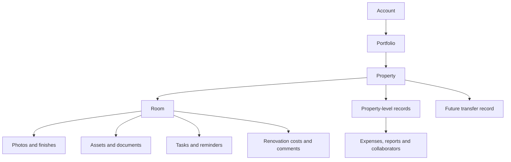

# Information and permissions

> Status: Draft for client approval  
> Version: 0.1  
> Prepared: 15 July 2026  
> Product name: Home Vault (working title)

## Information hierarchy

## Actors

| ID | Actor | Description |
| --- | --- | --- |
| ACT-01 | Visitor | A prospective customer viewing the public website. |
| ACT-02 | Free owner | A registered customer maintaining one property's core information. |
| ACT-03 | Paid owner or portfolio administrator | A subscriber managing active property, asset, task, cost and reporting features. |
| ACT-04 | Invited administrator | A trusted user allowed to manage the owner's permitted property information. |
| ACT-05 | Read-only collaborator | A trusted user allowed to view but not change permitted property information. |
| ACT-06 | Future buyer or new owner | A recipient of a buyer-safe property passport who may claim transferred property information. |

## Permission principles

- Property information is private by default.
- The owner controls invitations and access.
- Administrators may manage approved content but cannot manage ownership, subscriptions or transfer.
- Read-only users cannot change records.
- Financial visibility must be explicitly approved by role and scope.
- A future buyer receives only the approved transferable record.

## Transfer confidentiality

A buyer-safe transfer may include rooms, assets, warranty and maintenance information. It must exclude seller-only renovation labour, material costs, margin and other confidential financial records. Invoice visibility and price redaction remain open decisions.
